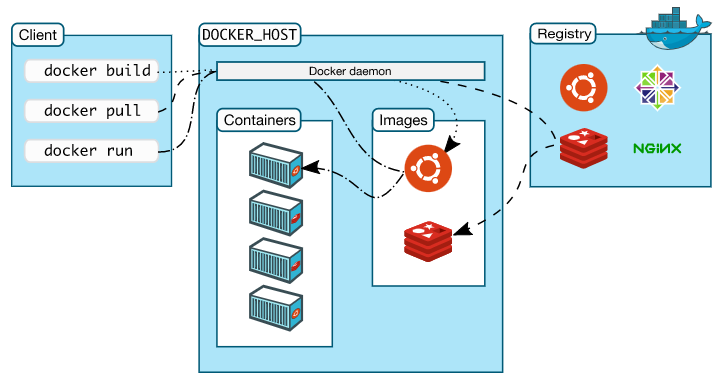
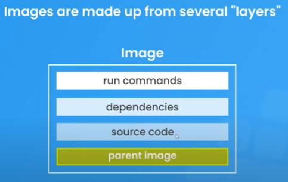
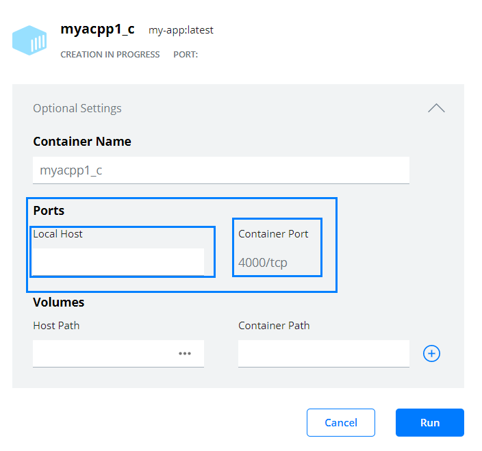
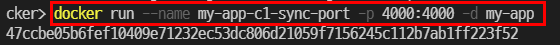
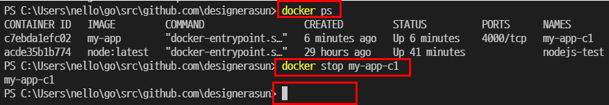
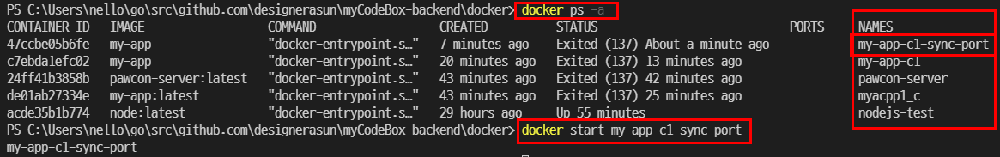

# Learning Docker essetials
## What is docker?
- Dockerfile ====(define docker image)====> Docker container(an instance of the image) ====> Docker CLI(based on image)

> Docker is an open platform for developing, shipping, and running applications. Docker enables you to separate your applications from your infrastructure so you can deliver software quickly.

> Docker provides the ability to package and run an application in a loosely isolated environment called a container. The isolation and security allow you to run many containers simultaneously on a given host.

### Install
Install docker desktop [here](https://hub.docker.com/editions/community/docker-ce-desktop-windows)
>  Docker Desktop includes the Docker daemon (dockerd), the Docker client (docker), Docker Compose, Docker Content Trust, Kubernetes, and Credential Helper.

## What can I use Docker for?
> Docker streamlines the development lifecycle **by allowing developers to work in standardized environments** using local containers which provide your applications and services. Containers are great for continuous integration and continuous delivery (CI/CD) workflows.

> Docker’s container-based platform allows for highly portable workloads. Docker containers can run on a developer’s local laptop, on physical or virtual machines in a data center, on cloud providers, or in a mixture of environments.

> Docker is lightweight and fast. It provides a viable, cost-effective alternative to hypervisor-based virtual machines, so you can use more of your compute capacity to achieve your business goals. Docker is perfect for high density environments and for small and medium deployments where you need to do more with fewer resources.

## Docker architecture
> Docker uses a client-server architecture. The Docker client talks to the Docker daemon, which does the heavy lifting of building, running, and distributing your Docker containers. The Docker client and daemon can run on the same system, or you can connect a Docker client to a remote Docker daemon.

> The Docker client and daemon communicate using a REST API, over UNIX sockets or a network interface. Another Docker client is Docker Compose, that lets you work with applications consisting of a set of containers.



### Docker daemon
> The Docker daemon (dockerd) listens for Docker API requests and manages Docker objects such as images, containers, networks, and volumes. A daemon can also communicate with other daemons to manage Docker services.

### Docker client
> The Docker client (docker) is the primary way that many Docker users interact with Docker. When you use commands such as docker run, the client sends these commands to dockerd, which carries them out. The docker command uses the Docker API. The Docker client can communicate with more than one daemon.

### Docker registry
> A Docker registry stores Docker images. Docker Hub is a public registry that anyone can use, and Docker is configured to look for images on Docker Hub by default. You can even run your own private registry.

> When you use the docker pull or docker run commands, the required images are pulled from your configured registry. When you use the docker push command, your image is pushed to your configured registry.

## Images
> An image is a **read-only template with instructions for creating a Docker container**. Often, an image is based on another image, with some additional customization. For example, you may build an image which is based on the ubuntu image, but installs the Apache web server and your application, as well as the configuration details needed to make your application run.



You can download a pre-made image(parent image) in [docker hub](https://hub.docker.com/). For example, download an official Node js image [here](https://hub.docker.com/_/node) with below command.

```shell
$docker pull node
```

> You might create your own images or you might only use those created by others and published in a registry. **To build your own image, you create a Dockerfile** with a simple syntax for defining the steps needed to create the image and run it. Each instruction in a Dockerfile creates a layer in the image. 

> When you change the Dockerfile and rebuild the image, only those layers which have changed are rebuilt. This is part of what asmakes images so lightweight, small, and fast, when compared to other virtualization technologies.

### Dockerfile
Create a Dockerfile to set an image.

```dockerfile
# FROM : Set the baseImage to use for subsequent instructions. 
# FROM must be the first instruction in a Dockerfile.
FROM node:17-alpine

# Set the working directory for any subsequent ADD, COPY, CMD, 
# ENTRYPOINT, or RUN instructions that follow it in the Dockerfile
WORKDIR /app

# COPY : Copy files or folders from source 
# to the dest path in the image's filesystem.
# Note that copy directory is relative to WORKDIR above. 
COPY . .

# Execute any commands on top of the current image 
# as a new layer and commit the results.
RUN npm install 

# Define the network ports that this container will listen on at runtime.
EXPOSE 4000

# Provide defaults for an executing container. 
# If an executable is not specified, then ENTRYPOINT must be specified as well. 
# There can only be one CMD instruction in a Dockerfile.
CMD ["node", "app.js"]
```

Once all done, build the image.

```shell
# -t : name tag for images
# . : relative path for dockerfile in the project
$docker build -t myapp .
```

Docker desktop will display the image if build was successful. You can run an image intance, meaning container. 

### Container
> A container is **a runnable instance of an image**.
> What is a container? Simply put, a container is a sandboxed process on your machine that is isolated from all other processes on the host machine. That isolation leverages kernel namespaces and cgroups, features that have been in Linux for a long time. Docker has worked to make these capabilities approachable and easy to use.
> A container is defined by its image as well as any configuration options you provide to it when you create or start it. When a container is removed, any changes to its state that are not stored in persistent storage disappear.

#### Matching port number in Docker desktop
You can sync local host port with Docker container port. The docker container port is set with EXPOSE command in Dockerfile.

```dockerfile
# set port 3000 for application in docker container
EXPOSE 3000 
```

Note that above port number 3000 is different from that of localhost port number but docker provides a way to bind the two like below.



Port mapping option will only be presented with the EXPOSE command in Dockerfile. Port mapping can be done in Docker desktop(GUI) like above or can be done in CLI as well.

#### Matching port number in CLI
Run docker images in CLI to check a current image list.

```shell
$docker images
```

Run docker run (image name) to run an image. Match localhost port with docker container port. 

```shell
$dokcer run --name (set-container-name-here) -p (container-port)(localhost-port) -d (image-name)
$docker run --name my-app-c1-sync-port -p 4000:4000 -d my-app
```



#### Stop docker container
Note that the process(docker container) executed with above docker run command can't be canceled with control + C key like normal processes can. You should dheck what processes are running(meaning containers) with docker ps and cancel it with docker stop command. 

```shell 
$docker ps # check current active processes(container)
$docker stop (container-name) # stop the process
```



or you can simply specify flag -d(detach the terminal from the container) like above command.

#### Start docker container
List all docker processes(containers) with docker ps -a and name the container you want to start. Note that docker ps command without -a flag only shows active processes. 

```shell
$docker ps -a
$docker start (container-name)
```



## Layer caching
> Whenever possible, Docker uses a build-cache to accelerate the docker build process significantly. This is indicated by the CACHED message in the console output. 

> When building an image, Docker steps through the instructions in your Dockerfile, executing each in the order specified. As each instruction is examined, Docker looks for an existing image in its cache that it can reuse, rather than creating a new (duplicate) image.

> Starting with a parent image that is already in the cache, the next instruction is compared against all child images derived from that base image to see if one of them was built using the exact same instruction. If not, the cache is invalidated.

> In most cases, simply comparing the instruction in the Dockerfile with one of the child images is sufficient. However, certain instructions require more examination and explanation.

> For the ADD and COPY instructions, the contents of the file(s) in the image are examined and a checksum is calculated for each file. The last-modified and last-accessed times of the file(s) are not considered in these checksums. During the cache lookup, the checksum is compared against the checksum in the existing images. If anything has changed in the file(s), such as the contents and metadata, then the cache is invalidated.

> Aside from the ADD and COPY commands, cache checking does not look at the files in the container to determine a cache match. For example, when processing a RUN apt-get -y update command the files updated in the container are not examined to determine if a cache hit exists. In that case just the command string itself is used to find a match.

## .dockerignore
> Before the docker CLI sends the context to the docker daemon, it looks for a file named .dockerignore in the root directory of the context. If this file exists, the CLI modifies the context to exclude files and directories that match patterns in it. This helps to avoid unnecessarily sending large or sensitive files and directories to the daemon and potentially adding them to images using ADD or COPY.

```.dockerignore
# comment
*/temp*
*/*/temp*
temp?
```

> The CLI interprets the .dockerignore file as a newline-separated list of patterns similar to the file globs of Unix shells. For the purposes of matching, the root of the context is considered to be both the working and the root directory. 


## API reference

List of basic Docker API is as follows : 

1. 
1. 
1. 
1. 
1. 


## Behind the scence

> Docker is written in the Go programming language and takes advantage of several features of the Linux kernel to deliver its functionality.
> Docker uses a technology called namespaces to provide the isolated workspace called the container. When you run a container, Docker creates a set of namespaces for that container.

> These namespaces provide a layer of isolation. Each aspect of a container runs in a separate namespace and its access is limited to that namespace.


## Reference

- [Docker official docs](https://docs.docker.com/get-started/)
- [Docker crash course - Net Ninja](https://youtube.com/playlist?list=PL4cUxeGkcC9hxjeEtdHFNYMtCpjNBm3h7)
- [Docker : .dockerignore file](https://docs.docker.com/engine/reference/builder/#dockerignore-file)
